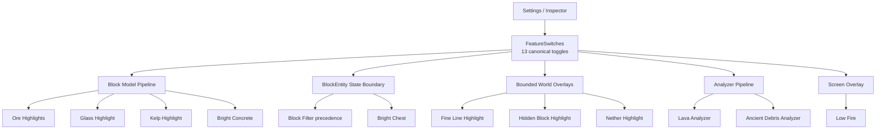

# ChiseTweaks

> Minecraftで「見えにくい」「置き方が合っているか分からない」「大きな建築の確認がつらい」を減らす、建築向けのFabricクライアントMODです。

ChiseTweaksは、**見つける・隠す・調べる・置き方を確認する**ための視認／検証機能を1つにまとめています。自動建築やサーバー側のワールド変更は行いません。

Current version: **`0.13.4+mc26.1.2`**

## 必要環境

| 項目 | 対応 |
| --- | --- |
| Minecraft | `26.1.2` |
| Fabric Loader | `0.19.3` 以上 |
| Fabric API | `0.155.2+26.1.2` 以上 |
| Java | `25` 以上 |
| 導入先 | クライアントのみ |
| Mod Menu | 任意 |
| Sodium | 任意 |

`chise-tweaks-<version>.jar` をクライアントの `mods` フォルダーへ入れてください。サーバー側へChiseTweaksを導入する必要はありません。

> **マルチプレイ**: Lava Analyzer / Ancient Debris Analyzerは壁越し表示を行います。クライアント専用MODでも、参加先サーバーのルールを優先してください。

## 13 Feature

ChiseTweaksのtoggle可能な機能は、`FeatureDefinition` / `FeatureSwitches` の**13機能を正本**として管理します。各toggleは独立しており、明示的な仕様がない限り相互排他にはしません。

| Surface | Feature | 役割 | 初期値 |
| --- | --- | --- | --- |
| Highlight | **Ore Highlights** | 鉱石・古代の残骸・黒曜石系へ強調表示 | OFF |
| Highlight | **Nether Highlight** | 見えているネザー建材を色分け | OFF |
| Highlight | **Fine Line Highlight** | 糸・トリップワイヤーフック等を見やすくする | OFF |
| Highlight | **Hidden Block Highlight** | 粉雪・青氷・死んだサンゴ等を強調 | OFF |
| Highlight | **Glass Highlight** | ガラス／板ガラスの形を見分けやすくする | OFF |
| Highlight | **Kelp Highlight** | 昆布へネオンマーカーを重ねる | OFF |
| Filter | **Block Filter** | Block IDのAllow/Hideルールでローカル描画を絞る | OFF |
| Filter | **Entity Filter** | Entity IDのAllow/Hideルールでローカル描画を絞る | OFF |
| Analyzer | **Lava Analyzer** | 読み込み済み近傍の溶岩源を壁越し表示 | OFF |
| Analyzer | **Ancient Debris Analyzer** | 読み込み済みNether chunkの古代の残骸を壁越し表示 | OFF |
| Visibility | **Low Fire** | 一人称の炎overlayを下げる | OFF |
| Visibility | **Bright Chest** | Chest / Double Chestの視認性を改善 | ON |
| Visibility | **Bright Concrete** | White Concreteの視認性を改善 | ON |

Inspector、Placement Preview / Actual Comparison、Pattern Consistencyは設定画面の検証ワークフローとして提供されます。

## 設定画面

設定画面は5 Surfaceです。6つ目のタブや万能scannerを増やさず、役割ごとに分離しています。

| Tab | 用途 |
| --- | --- |
| **Highlight** | 見えている建材・鉱石・ガラス・昆布・細線などを強調 |
| **Filter** | ブロック／エンティティの表示をAllow/Hideルールで整理 |
| **Inspector** | BlockState、配置予測、配置結果、パターン差分を確認 |
| **Analyzer** | Lava / Ancient Debrisの限定的な壁越し解析 |
| **Visibility** | Low Fire / Bright Chest / Bright Concrete |

設定は `chisetweaks.json` と `chisetweaks-visual.json` の担当domainへ保存されます。13機能はUI・Inspector・監査から同じFeature registryを参照します。

## 描画アーキテクチャ

### Bright Chest / Bright Concrete

Bright系は**built-in Resource Packの選択状態をFeatureとして扱いません**。通常のChiseTweaks描画機能として動作します。

- **Bright Chest**: `BlockEntityRenderDispatcher.tryExtractRenderState` の共通境界で、通常Chestのrender stateへChiseのChest spriteを適用します。
- **Bright Concrete**: 既存のblock-model pipelineでWhite ConcreteだけをChiseの明るい専用modelへ置換します。
- Bright Concreteは旧表示と同じく**通常のMinecraft照明**を受けます。Ore / Glass / Kelpのfullbright overlayとは分離されています。
- ON/OFFのためにResource Pack selectionを変更せず、Resource Pack reloadも要求しません。
- 旧版でBright packをOFFにしていた設定は、アップデート時にローカル設定へ一度移行します。

Block Filterで対象をHIDEした場合は、Bright Chestを含む視認補助より**Block Filterの非表示が優先**されます。

## Highlight

### Ore Highlights

鉱石、古代の残骸、黒曜石系などへ、元の見た目を残したまま強調表示を重ねます。壁越し探索ではありません。壁越しの古代の残骸表示はAncient Debris Analyzerです。

### Glass Highlight

透明／色付きガラスと板ガラスへ形状別のマーカーを重ねます。元のガラス色は保持します。

### Fine Line / Hidden Block / Nether Highlight

すでに読み込まれている近傍をbounded scanし、必要な対象だけをworld overlayへ渡します。未ロードchunkの強制読み込みは行いません。

### Kelp Highlight

昆布／昆布の茎へマゼンタ×オレンジの視認マーカーを重ねます。

## Filter

### Block Filter

Block IDを指定してAllow/Hideルールを作ります。通常ブロック、BlockEntity、Chise overlayでHIDE優先を維持します。ワールドからブロック自体を削除する機能ではありません。

### Entity Filter

Entity IDを指定してローカル描画をAllow/Hideします。一般的なocclusion/cullingは専用描画MODへ委ねます。

## Inspector

InspectorはMinecraftがすでに持つcrosshair hitとBlockStateから、読み取り専用snapshotを作ります。

### Placement Preview / Actual Comparison

対応ブロックは、置く直前のBlockStateを予測し、実際の配置後に `MATCH` / `ADJUSTED` / `DIFFERENT` を確認できます。入力注入や自動設置は行いません。

代表的な対応対象:

- Trapdoor
- Log / Wood / Stem / Hyphae
- Froglight
- Slab / Stairs
- Glazed Terracotta
- Fence Gate
- Grindstone
- Beehive / Bee Nest
- Campfire

### Pattern Consistency

ユーザーが選んだReferenceと**同じBlock ID**の近傍BlockStateを比較します。多数決ではなくReferenceが正本です。対象は読み込み済みchunkに限定され、保持件数・走査量にも上限があります。

## Analyzer

### Lava Analyzer

近傍の**溶岩源だけ**を壁越しmarkerで表示します。flowing lavaは対象外です。探索はboundedで、読み込み済み範囲だけを扱います。

### Ancient Debris Analyzer

Netherで読み込み済みchunkからAncient Debrisを検出し、上限付きretained markerとして表示します。未ロードchunkを要求・生成しません。

LavaとAncient Debrisはrenderer lifecycleを共有しても、**scanner algorithmとtoggleは独立**しています。

## Visibility

### Low Fire

一人称視点のfire overlayだけを下げます。ワールド上の炎やresource-pack textureは変更しません。

### Bright Chest

通常Chest / Double ChestへChise専用の見やすいspriteを直接適用します。BlockEntityのNBT、コンテナ内容、看板本文などを読み取りません。

### Bright Concrete

White Concreteだけを明るい専用texture/modelで表示します。通常照明を維持し、Ore / Glass / Kelpのfullbright処理を流用しません。

## 安全性と境界

ChiseTweaksはクライアント側の建築支援MODとして、次を行いません。

- サーバー側MODの導入要求
- ChiseTweaks独自のプレイ用packet送信
- blockの自動設置／自動破壊
- mouse／keyboard input injection
- 未ロードchunkの強制読み込み
- background threadによるworld scan
- 自動MOD download／JAR自己置換
- telemetry送信
- InspectorでのBlockEntity NBT、看板本文、本、chat、inventory、container内容、UUID取得

## Performance

描画系は機能ごとに必要な方式を使い分けます。

- Ore / Glass / Kelp / Bright Concrete: block-model pipeline
- Bright Chest / Block Filter: BlockEntity state extraction boundary
- Fine Line / Hidden / Nether: bounded local scan + overlay
- Lava / Ancient Debris: bounded analyzer + retained marker
- Low Fire: first-person screen overlay

配布runtime JARには**446,814 bytesのhard ceiling**があります。機能等価性を壊す容量削減は採用しません。長期目標は350KiB (`358,400 bytes`) です。

## 開発・QA

変更はGitHub Actionsで以下を検証します。

- compile / JUnit
- repository / compatibility / functional parity audits
- JaCoCo coverage gate
- PIT mutation gate
- Client GameTest
- artifact / visual asset / release residue audits
- runtime JAR size ceiling

GPU・shader・Prism Launcher上の見え方のようにheadless CIで完全自動化できない項目は、実機acceptanceとして別管理します。自動化できない確認をCI PASS扱いにはしません。

## License

リポジトリの `LICENSE` を参照してください。
