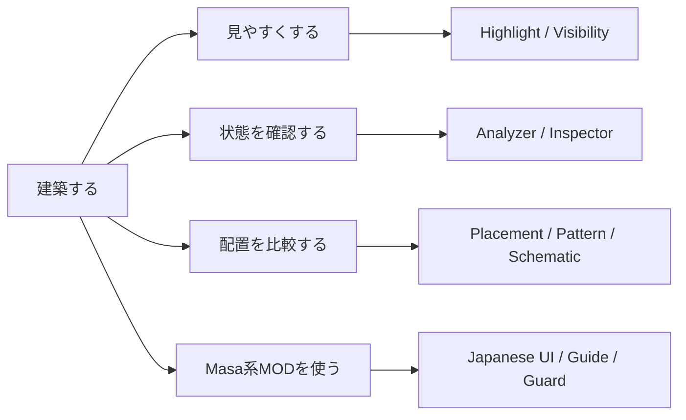

# ChiseTweaks

> Minecraftの建築で「見えにくい」「状態が分からない」「設計図どおり置けたか不安」を減らす、**建築者向けFabricクライアントMOD**です。

ChiseTweaksは、ブロックや設備を**見やすくする・状態を確認する・配置結果を比較する・Masa系MODを使いやすくする**ための機能をまとめています。

**Auto Eat / Auto Restock / Auto Move / Auto Totem / Auto Repair / Auto Fill Schematic Inventory / Auto Void Trade などの自動操作機能は、意図的に実装しません。**  
ChiseTweaksはプレイヤーの代わりに操作するMODではなく、**見る・調べる・比較する・外部MODを安全に使う**ことに範囲を絞っています。

Repository version: **`0.15.0+mc26.1.2`**  
このREADMEは`main`ブランチの現在仕様を説明します。配布済みReleaseより先行している場合があります。

---

## まず3行で

- **建築物や設備を見やすくしたい** → Highlight / Visibility
- **向き・BlockState・配置ミスを確認したい** → Inspector / Analyzer
- **LitematicaなどMasa系MODが英語で分かりにくい** → Integrations / Masa Guide / Japanese UI



---

## 初めて導入する人へ

### 必要なもの

| 項目 | 必要条件 |
| --- | --- |
| Minecraft | `26.1.2` |
| Fabric Loader | `0.19.3` 以上 |
| Fabric API | `0.155.2+26.1.2` 以上 |
| Java | `25` 以上 |
| 導入先 | **クライアントのみ** |
| Mod Menu | 任意。**初めて使う場合は導入推奨** |
| Sodium | ChiseTweaks単体では任意。**Nvidiumを使う場合はNvidium側の要件として必須** |

サーバー側へChiseTweaksを入れる必要はありません。

### 導入手順

1. Minecraft `26.1.2` のFabric環境を用意します。
2. Fabric APIを入れます。
3. `chise-tweaks-<version>.jar` をその環境の `mods` フォルダーへ入れます。
4. Minecraftを起動します。
5. Mod Menuを使う場合は、**Mods → ChiseTweaks → Config** から設定画面を開きます。

> Prism Launcherを使う場合は、対象インスタンスを編集して **Mods → ファイルを追加** からJARを追加すると簡単です。

バージョンが違うMinecraft / Fabric環境へ入れると起動できない場合があります。まず上の必要条件を確認してください。

---

## ChiseTweaksでできること

ChiseTweaksは、**建築者向けのVisual / Workflow Tweaks**として整理しています。  
内部には互換性維持のため16個のlow-level runtime toggleがありますが、ユーザーが覚える製品構造は次の**7グループ**です。

| グループ | 主な機能 |
| --- | --- |
| **Visual Tweaks** | Low Fire / Handheld Size / Bright Blocks |
| **Builder Highlights** | Ore / Glass / Kelp / Nether Materials / Lava Source / Occluded Blocks |
| **Technical Visualization** | Fine Line / Tripwire / Beacon Range / Lightning Rod Range / Villager Job Site Links |
| **Scene Filter** | Block Filter / Entity Filter |
| **Builder Assist** | Block Info / Placement Assist / Pattern Check |
| **Workflow** | Interaction History |
| **Integrations** | Litematica Placement Assist / Pick Redirect / Masa Guards / Gamma / Material Refresh / Syncmatica / Nvidium |

### 1. Visual Tweaks

普段の視界を少しだけ使いやすくする軽量なTweaksです。

- **Low Fire** — 一人称の炎を低く・小さくする
- **Handheld Size** — Resource Packを置き換えず、一人称の手持ちItemをBlock / Item / Weapons & Tools別に縮小する
- **Bright Blocks** — Chest / White Concreteを暗所で見分けやすくする

Handheld Sizeの初期倍率は **Block 70% / Item 60% / Weapons & Tools 75%**、Shieldは95%固定です。GUI・三人称・world itemには適用しません。

### 2. Builder Highlights

「建築対象そのものを見つけやすくする」を一つのグループにまとめています。

**Visible Highlights**
- Ore Highlights
- Nether Materials
- Glass
- Kelp

**Occluded Highlights**
- Lava Source
- Powder Snow
- Blue Ice
- Dead Coral
- Sculk Catalyst

Lava SourceとOccluded Blocksは別々のON/OFFを維持しつつ、内部では**1つのbounded scan budget / schedule / loaded-chunk traversal**を共有します。未ロードchunkを強制読み込みせず、ChiseTweaks独自のscan packetも送りません。

> **サーバールールを先に確認してください。** Occluded Highlightsはクライアントへ既に届いている読み込み済みchunk内の情報を限定的に壁越し表示します。through-wall表示をX-Ray / 透視として禁止するサーバーでは使用しないでください。サーバー側Anti-X-Rayの情報を迂回・復元する機能はありません。

### 3. Technical Visualization

Minecraft内部の「範囲・接続・技術的な構造」を見えるようにします。

- **Fine Line / Tripwire** — 糸やトリップワイヤーフックを見つけやすくする
- **Beacon Range** — Beaconの有効範囲を表示
- **Lightning Rod Range** — 避雷針の有効範囲を表示
- **Villager Job Site Links** — Minecraftが`JOB_SITE`として既に把握している村人と職業ブロックだけを線で結ぶ

Villager Job Site Linksは、以前のfallback workstation探索を行いません。関係が不明な場合は**推測せず表示しない**ため、余計なblock scanと誤判定を避けます。

### 4. Scene Filter

Block / Entityを削除するのではなく、**自分の画面上の描画だけ**をAllow / Hideルールで絞ります。

- Block Filter
- Entity Filter

### 5. Builder Assist

大きな「Inspector」ではなく、建築時に必要な読み取り支援へ絞っています。

- **Block Info** — 見ているBlockのIDと必要なBlockStateを表示
- **Placement Assist** — Vanillaの配置結果を事前予測し、配置後は必要最小限の結果比較を表示
- **Pattern Check** — Referenceと同じBlock IDのBlockState差分を確認

旧Crosshair Inspectorにあった **Filter Decision / Matched Rule / Responsible Feature / Render Mode** のような開発者向け診断表示は通常UIから削除しました。

### 6. Workflow

**Interaction History**だけを担当します。直近64件までの配置・破壊・Item使用・Entity操作をメモリ内に保持し、チャット・看板・本・Container内容は記録しません。

### 7. Integrations

Masa系MODやrendererの既存機能へ、小さな安全性・Workflow改善を追加します。外部MODはすべてoptionalです。

| 対象 | ChiseTweaks側のTweak |
| --- | --- |
| **Litematica** | Placement Assist / Pick Redirect |
| **Tweakeroo** | Tool Switch Guard / Persistent Gamma復元 |
| **TweakerMore** | Auto Pick Guard / Material List Refresh |
| **Syncmatica** | Remove Disable / Require Shift To Remove |
| **MaLiLib / Masa系全体** | Japanese UI / Masa Guide |
| **Nvidium** | World Border / far-coordinate compatibility guard |

Litematica Placement AssistはExpectedとVanillaの配置予測を比較しますが、配置を禁止・自動化しません。各GuardもChiseTweaks自身がAuto Pick / Tool Switchを実行するものではありません。

### 初めてなら

1. まず初期設定のまま起動します。
2. 視界が気になる場合だけ **Visual Tweaks** を調整します。
3. 建築材料を見分けたい場合は **Builder Highlights**。
4. Beacon・避雷針・交易所・Tripwire作業では **Technical Visualization**。
5. 向きや配置を確認したい場合は **Builder Assist**。
6. Litematica等を使う場合だけ **Integrations** を設定します。

全部を最初からONにする必要はありません。**必要なTweaksだけONにする**設計です。

---

## ChiseTweaksが意図的にやらないこと

ChiseTweaksは**Automation MODにはしません**。これは機能不足ではなく、製品方針です。

次のような機能は今後もChiseTweaks自身では実装しません。

- Auto Eat
- Auto Restock
- Auto Move / Hold Move
- Auto Totem
- Auto Repair
- Auto Drop
- Auto Firework
- Auto Fill Schematic Inventory
- Auto Void Trade
- Inventory操作の自動化
- 自動クリック / 連打 / keyboard input injection
- 自動建築 / 自動配置

基本方針は次のとおりです。

> **見やすくする。必要な情報を少しだけ見せる。既存MODを安全に補助する。  
> ただし、プレイヤーの代わりにMinecraftを操作しない。**

---

## 安全性・動作範囲

ChiseTweaksはクライアント側の建築支援に範囲を絞っています。

- サーバー側へのChiseTweaks導入は不要
- ChiseTweaks独自のプレイ用packetを送らない
- 未ロードchunkを強制読み込みしない
- 自動MODダウンロード / JAR置換をしない
- 外部Masa系MODが無くても起動できる
- optional integrationが壊れた場合も他機能へ影響を広げにくいfail-soft設計

---

## 品質保証 — S-grade hardening

ChiseTweaksは、機能数だけでなく**壊れにくさ・回帰検出・性能・配布物の再現性**も製品品質として扱います。  
`0.15.0+mc26.1.2` のmainでは、S1〜S9の品質強化を実装しています。

| 領域 | 現在の保証 |
| --- | --- |
| **S1 Architecture** | core / config / feature / integrationなどの依存境界をテストし、禁止された逆依存を検出 |
| **S2 GUI responsibility** | Screenへ保存・registry lookup・domain mutation責務が戻らないよう契約テストで保護 |
| **S3 Visualization performance** | Occluded HighlightsはLava / Hiddenで1つのbounded traversal budgetを共有し、hot-pathではBlock identity + bit maskを使う |
| **S4 Performance acceptance** | startup / p50 / p95 / p99 frametime / heap / allocation / render-thread CPU / FPSの8指標を同一環境で比較 |
| **S5 Runtime safety** | component障害をquarantineし、他機能へ障害を広げないことをfault injectionで検証 |
| **S6 Config / Security** | malformed / oversized / deep JSON、Unicode、budget境界、migrationを敵対テスト |
| **S7 Test responsibility** | policy / runtime / UI / performance / Minecraft GameTest / distributionの各リスクに検証責務を割り当て |
| **S8 Release evidence** | tested tree SHA・runtime SHA-256・provenanceを記録し、検証したJARそのものをReleaseへ昇格 |
| **S9 Product scope** | client-only / no custom play protocol / no input automation / no packet ownershipを実行可能contractで固定 |

### PerformanceのS判定

Performanceはコード上の設計だけでS判定しません。**同一Prism環境で実測した証拠**を使用します。

必須metric:

- startup time
- p50 / p95 / p99 frametime
- heap usage
- allocation MiB/s
- render-thread CPU
- average FPS

S-grade regression budget:

| Metric | 許容regression |
| --- | ---: |
| startup | 10% |
| p50 frametime | 5% |
| p95 frametime | 5% |
| p99 frametime | 10% |
| heap | 10% |
| allocation | 10% |
| render-thread CPU | 10% |
| average FPS | 5%低下まで |

実GPU / Windows / Prism / JFRの測定値が無い状態では、**tooling ready / measurement pending**として扱い、測定値を推測してS判定しません。

### Runtime JARの容量方針

配布用runtime JARは、機能を壊して小さくするのではなく、**機能等価性を維持したまま容量を削減**します。

- 最終目標: **350 KiB / 358,400 bytes以下**
- hard ceiling: **446,814 bytes**
- SourceFile / LineNumberを容量削減のために削除しない
- shrinker / obfuscationだけで数値を達成しない
- 容量削減でも7製品グループのユーザー能力・16 low-level toggle・optional integrationの回帰を許容しない

---

## 設定ファイル

設定画面から変更した内容は、役割ごとに分けて保存されます。

| ファイル | 主な内容 |
| --- | --- |
| `chisetweaks.json` | Builder Highlights / Scene Filterなどの基本toggle |
| `chisetweaks-visual.json` | Visual Tweaks / Occluded Highlights / Workflow / Litematica Placement Assist |
| `chisetweaks-integrations.json` | Masa ecosystem連携 |
| `chisetweaks-compatibility.json` | Nvidiumなどrenderer compatibility |

通常は設定ファイルを直接編集する必要はありません。

古い設定や将来版の設定を読んだ場合も、**未知の項目だけでゲーム全体を落とさない**ことを基本方針にしています。既知項目は可能な範囲で引き継ぎ、壊れたJSONや型が互換でない値は、その設定domainを安全なdefaultへ戻して起動を継続します。設定名や型を変更するreleaseでは、migrationと回帰fixtureを追加してから変更します。

---

## よくある質問

### サーバーにも入れる必要がありますか？

ありません。**クライアントだけ**に導入します。

### Litematicaがなくても使えますか？

使えます。LitematicaやTweakerooなどはoptional integrationです。無いMOD向けの連携だけが無効になります。

### 自動建築MODですか？

違います。自動配置や自動クリックはしません。建築を**見やすく、確認しやすくするMOD**です。

### Ore HighlightsはX-Rayですか？

Ore Highlights自体は、見えている対象を強調するHighlightで、壁の向こうの鉱石を広域探索する機能ではありません。

一方、**Builder Highlights → Occluded Highlightsは読み込み済み近傍を限定的に壁越し表示します。** サーバー管理者がthrough-wall表示をX-Ray / 透視として禁止している場合は使用しないでください。ChiseTweaksは独自scan packetや強制chunk loadを行わず、サーバー側Anti-X-Rayの難読化も迂回しません。

### Masa系MODの英語設定が分かりません

**Integrations → Masa Japanese UI / Masa Guide** を使ってください。英語名も残すため、Wikiや動画と照合しやすくしています。

---

## 開発者向け

実装・互換性・QA・CI・Release・Performance契約は [`DEVELOPMENT.md`](DEVELOPMENT.md) を参照してください。

代表的な検証コマンド:

```bash
./gradlew --stacktrace ciGate
./gradlew --stacktrace runClientGameTest
```

`ciGate`はJUnit / JaCoCo / PIT / buildをまとめて実行し、Client GameTestではMinecraft runtime上のplacement oracleと16 low-level toggle同時ONの回帰を確認します。

現在の主な品質閾値:

- JaCoCo line coverage: **96%**
- PIT coverage: **96%**
- Mutation score: **96%**
- Test strength: **96%**
- runtime JAR target: **358,400 bytes**
- runtime JAR hard ceiling: **446,814 bytes**

Releaseではruntime JARを再buildせず、CIで検証したartifactのtree SHA / SHA-256 / provenanceを確認して同一byte列を公開する設計です。

製品UIは7つのTweaksグループを正本とし、互換性のための16 low-level runtime toggleは `FeatureDefinition` / `FeatureSwitches` で独立管理します。
