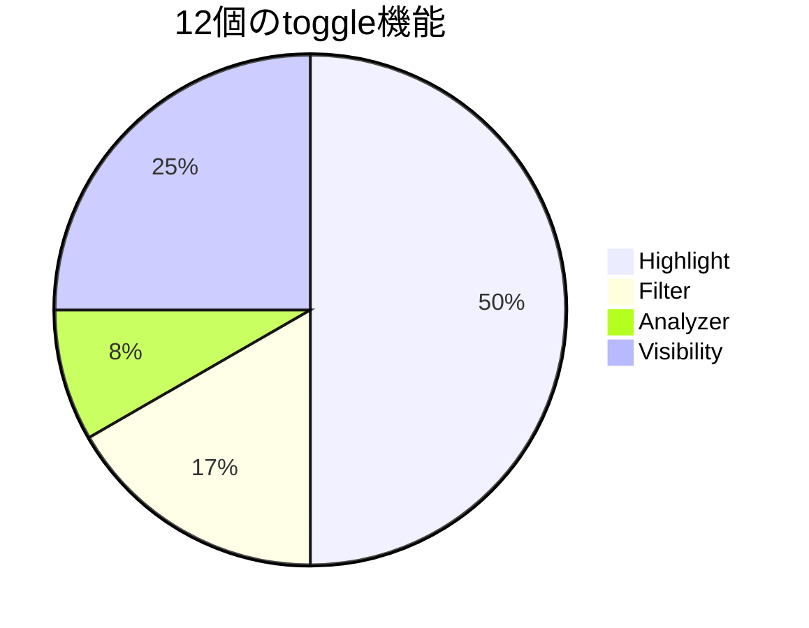
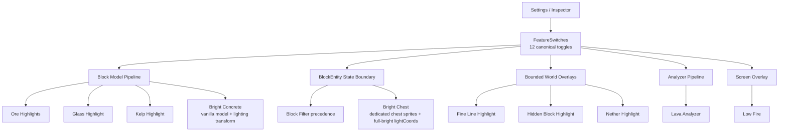

# ChiseTweaks

> Minecraftの建築で「見えにくい」「ブロックの状態が分かりにくい」「大きな建築の確認がつらい」を減らす、FabricクライアントMODです。

ChiseTweaksは、**強調表示・表示フィルター・状態確認・配置予測・視認性改善**を1つの画面にまとめます。サーバー側のゲーム進行を変える機能や、自動配置・隠れ資源探索のような機能は現在の製品スコープに含めません。

Current version: **`0.15.0+mc26.1.2`**  
開発・QA・CI・Releaseの現在契約は [`DEVELOPMENT.md`](DEVELOPMENT.md) を参照してください。

## 必要環境

| 項目 | 対応 |
| --- | --- |
| Minecraft | `26.1.2` |
| Fabric Loader | `0.19.3` 以上 |
| Fabric API | `0.155.2+26.1.2` 以上 |
| Java | `25` 以上 |
| 導入先 | クライアントのみ |
| Mod Menu | 任意 |
| Sodium | 任意 |

`chise-tweaks-<version>.jar` をクライアントの `mods` フォルダーへ入れてください。サーバー側へChiseTweaksを導入する必要はありません。

## まず知っておくこと

設定画面には**12個のON/OFF機能**があります。Bright Chest / Bright Concreteだけ初期ONで、ほかの10機能は初期OFFです。

InspectorのBlockState確認、Placement Preview / Actual Comparison、Pattern ConsistencyはON/OFF機能とは別の**読み取り・検証capability**です。

| Surface | Feature | 役割 | 初期値 |
| --- | --- | --- | --- |
| Highlight | **Ore Highlights** | 鉱石・古代の残骸・黒曜石系へ強調表示 | OFF |
| Highlight | **Nether Highlight** | 見えているネザー建材を色分け | OFF |
| Highlight | **Fine Line Highlight** | 糸・トリップワイヤーフック等を見やすくする | OFF |
| Highlight | **Hidden Block Highlight** | 粉雪・青氷・死んだサンゴ等を強調 | OFF |
| Highlight | **Glass Highlight** | ガラス／板ガラスの形を見分けやすくする | OFF |
| Highlight | **Kelp Highlight** | 昆布へネオンマーカーを重ねる | OFF |
| Filter | **Block Filter** | Block IDのAllow/Hideルールでローカル描画を絞る | OFF |
| Filter | **Entity Filter** | Entity IDのAllow/Hideルールでローカル描画を絞る | OFF |
| Analyzer | **Lava Analyzer** | 読み込み済み近傍の溶岩源を壁越し表示 | OFF |
| Visibility | **Low Fire** | 一人称の炎overlayをLarge / Medium / Smallで縮小 | OFF |
| Visibility | **Bright Chest** | 通常Chest / Double Chestを白く明るく表示 | ON |
| Visibility | **Bright Concrete** | White Concreteを暗所でも判別しやすくする | ON |

`FeatureDefinition` / `FeatureSwitches` の12機能を正本として管理します。各toggleは独立しており、**12機能すべて同時ON**も回帰条件です。

## 設定画面

設定画面は5 Surfaceです。

| Tab | 用途 |
| --- | --- |
| **Highlight** | 見えている建材・鉱石・ガラス・昆布・細線などを強調 |
| **Filter** | ブロック／エンティティの表示をAllow/Hideルールで整理 |
| **Inspector** | BlockState、配置予測、配置結果、パターン差分を確認 |
| **Analyzer** | Lavaの限定的な壁越し解析 |
| **Visibility** | Low Fire / Bright Chest / Bright Concrete |

設定は `chisetweaks.json` と `chisetweaks-visual.json` の担当domainへ保存されます。UI・Inspector・監査は同じFeature registryを参照します。

## 実装の全体像

## Highlight

### Ore Highlights

鉱石、古代の残骸、黒曜石系などへ、**元のブロックを見える状態のまま**強調表示を重ねます。壁の向こうの資源を探索する機能ではありません。

### Glass Highlight

透明／色付きガラスと板ガラスへ形状別のマーカーを重ねます。元のガラス色は保持します。

### Fine Line / Hidden Block / Nether Highlight

すでに読み込まれている近傍をbounded scanし、必要な対象だけをworld overlayへ渡します。未ロードchunkの強制読み込みは行いません。

### Kelp Highlight

昆布／昆布の茎へマゼンタ×オレンジの視認マーカーを重ねます。

## Filter

### Block Filter

Block IDを指定してAllow/Hideルールを作ります。通常ブロック、BlockEntity、Chise overlayでHIDE優先を維持します。ワールドからブロック自体を削除する機能ではありません。

### Entity Filter

Entity IDを指定してローカル描画をAllow/Hideします。一般的なocclusion/cullingは専用描画MODへ委ねます。

## Inspector / Placement Preview

### Crosshair Inspector

Minecraftがすでにクライアントへ持っているcrosshair hitとBlockStateから、読み取り専用snapshotを作ります。

### Placement Preview / Actual Comparison

対応ブロックは、置く直前のBlockStateを予測し、実際の配置後に `MATCH` / `ADJUSTED` / `DIFFERENT` を確認できます。

これは**配置操作を自動化する機能ではありません**。クリック入力を注入せず、通常のMinecraft操作を変更しません。

代表的な対応対象:

- Trapdoor
- Log / Wood / Stem / Hyphae
- Froglight
- Slab / Stairs
- Glazed Terracotta
- Fence Gate
- Grindstone
- Beehive / Bee Nest
- Campfire

### Pattern Consistency

ユーザーが選んだReferenceと**同じBlock ID**の近傍BlockStateを比較します。多数決ではなくReferenceが正本です。対象は読み込み済みchunkに限定されます。

- 水平半径: 8 blocks
- 垂直範囲: ±4 blocks
- 最大処理: 256 blocks / tick
- 最大保持Mismatch: 64
- 再走査: 20 ticks
- Referenceはmemory-onlyで、dimension change / disconnect時に破棄

## Analyzer

### Lava Analyzer

近傍の**溶岩源だけ**を壁越しmarkerで表示します。flowing lavaは対象外です。探索はboundedで、読み込み済み範囲だけを扱います。

- 未ロードchunkを要求しない
- worldを変更しない
- Chise独自のplay packetを送らない
- marker数とscan範囲に上限を持つ

## Visibility

### Low Fire

一人称視点のfire overlayだけを **Large / Medium / Small** の3段階で低く・小さくします。

- Minecraftが現在の描画へ渡すfire spriteをそのまま再利用
- 通常炎と魂の炎を同じrendererで扱い、種類ごとのChise専用PNGは持たない
- 使用中のResource Packがfire spriteを変更している場合も、その現在spriteを尊重
- ワールド上のFire / Soul Fire modelは変更しない
- サイズ変更でResource Pack reloadを行わない
- block scan / chunk scan / server packetを追加しない

つまり、外部Low-Fire系Resource Packの画像資産を内蔵するのではなく、「一人称の炎だけを低くする」という要求だけをChise独自実装へ落としています。

### Bright系はResource Pack切替を持ちません

Bright Chest / Bright Concreteは、built-in Resource Packの選択変更や切替reloadを行わず、それぞれの描画経路で直接切り替えます。

#### Bright Chest

通常Chest / Double Chestを、チェストの形状・金具・蓋・開閉animationを維持したまま白く明るく見せます。

- `normal.png` / `normal_left.png` / `normal_right.png` のChest専用3 textureを使用
- MinecraftのChest model / double-chest分割 / 開閉animationはそのまま
- **White Concrete spriteをChestへ貼らない**
- vanilla CHEST atlas経路を使用
- Resource Pack selection変更 / reloadなし
- Trapped / Ender / Copper Chestには適用しない
- Block FilterでHIDEされた場合は非表示を優先

#### Bright Concrete

White Concreteのvanilla modelと現在のtextureをそのまま使用し、そのmodelが出すquadへfull-bright lighting属性を適用します。

- 専用Concrete PNGなし
- 専用replacement modelなし
- 追加model emissionなし
- Resource Pack reloadなし
- block scanなし

## 安全性と境界

ChiseTweaksはクライアント側の**建築確認・視認補助**に範囲を絞ります。

行わないこと:

- サーバー側MODの導入要求
- ChiseTweaks独自のプレイ用packet送信
- 自動クリック／連打／keyboard input injection
- 自動建築・自動配置
- 未ロードchunkの強制読み込み
- 隠れ資源の広域探索
- Wardenのserver-only warning stateの推測表示
- persistent gammaの書き換え
- 外部Resource Packファイルの削除

## QA / CI

PRでは次をまとめて確認します。

- repository / source / documentation / compatibility contract audit
- JUnit
- JaCoCo
- PIT mutation testing
- Client GameTest
- artifact / distribution audit
- runtime JAR size ceiling
- 12機能all-on regression

CIで代替できないPrism Launcher / Windows / 実GPUの見た目は、別のacceptance smokeとして確認します。
