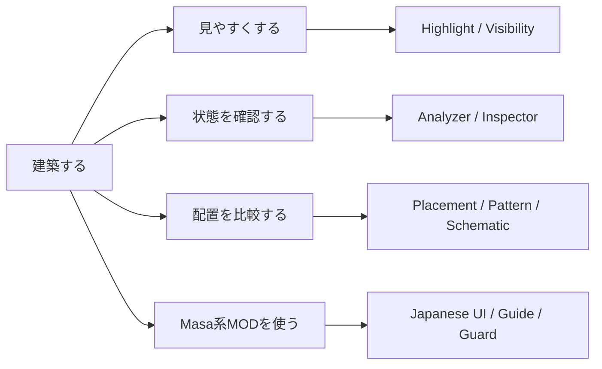
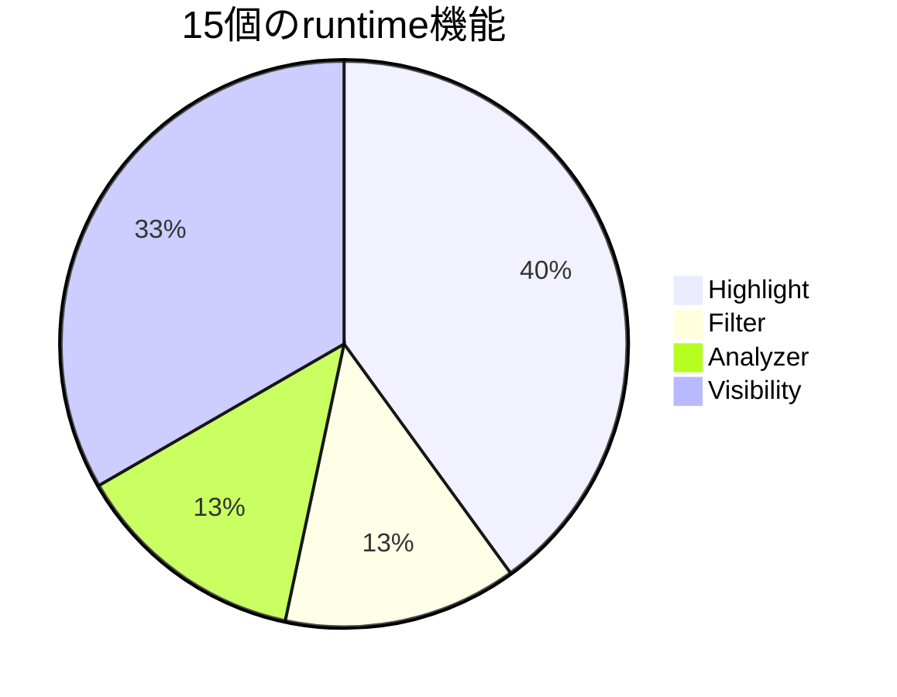

# ChiseTweaks

> Minecraftの建築で「見えにくい」「状態が分からない」「設計図どおり置けたか不安」を減らす、**建築者向けFabricクライアントMOD**です。

ChiseTweaksは、ブロックや設備を**見やすくする・状態を確認する・配置結果を比較する・Masa系MODを使いやすくする**ための機能をまとめています。

**Auto Eat / Auto Restock / Auto Move / Auto Totem / Auto Repair / Auto Fill Schematic Inventory / Auto Void Trade などの自動操作機能は、意図的に実装しません。**  
ChiseTweaksはプレイヤーの代わりに操作するMODではなく、**見る・調べる・比較する・外部MODを安全に使う**ことに範囲を絞っています。

Current version: **`0.15.0+mc26.1.2`**

---

## まず3行で

- **建築物や設備を見やすくしたい** → Highlight / Visibility
- **向き・BlockState・配置ミスを確認したい** → Inspector / Analyzer
- **LitematicaなどMasa系MODが英語で分かりにくい** → Integrations / Masa Guide / Japanese UI

---

## 初めて導入する人へ

### 必要なもの

| 項目 | 必要条件 |
| --- | --- |
| Minecraft | `26.1.2` |
| Fabric Loader | `0.19.3` 以上 |
| Fabric API | `0.155.2+26.1.2` 以上 |
| Java | `25` 以上 |
| 導入先 | **クライアントのみ** |
| Mod Menu | 任意。**初めて使う場合は導入推奨** |
| Sodium | 任意 |

サーバー側へChiseTweaksを入れる必要はありません。

### 導入手順

1. Minecraft `26.1.2` のFabric環境を用意します。
2. Fabric APIを入れます。
3. `chise-tweaks-<version>.jar` をその環境の `mods` フォルダーへ入れます。
4. Minecraftを起動します。
5. Mod Menuを使う場合は、**Mods → ChiseTweaks → Config** から設定画面を開きます。

> Prism Launcherを使う場合は、対象インスタンスを編集して **Mods → ファイルを追加** からJARを追加すると簡単です。

バージョンが違うMinecraft / Fabric環境へ入れると起動できない場合があります。まず上の必要条件を確認してください。

---

## ChiseTweaksでできること

現在、**15個のON/OFF可能なruntime機能**があります。  
初期状態では **Bright Chest / Bright ConcreteだけON**、それ以外の13機能はOFFです。

### Highlight — 見えにくいものを強調する

| 機能 | 何ができる？ | 初期値 |
| --- | --- | --- |
| **Ore Highlights** | 鉱石、古代の残骸、黒曜石系などを見分けやすくする | OFF |
| **Nether Highlight** | ネザーの建材を色分けして見やすくする | OFF |
| **Fine Line Highlight** | 糸やトリップワイヤーフックなど細い対象を見やすくする | OFF |
| **Hidden Block Highlight** | 粉雪、青氷、死んだサンゴ、スカルクカタリストなどを強調する | OFF |
| **Glass Highlight** | ガラスと板ガラスの形を見分けやすくする | OFF |
| **Kelp Highlight** | 昆布を見つけやすくする | OFF |

Ore Highlightsは**今見えているブロックへ強調表示を重ねる機能**です。壁の向こうの鉱石を広域探索する機能ではありません。

### Filter — 一時的に表示を絞る

| 機能 | 何ができる？ | 初期値 |
| --- | --- | --- |
| **Block Filter** | Block IDのAllow / Hideルールで表示するブロックを絞る | OFF |
| **Entity Filter** | Entity IDのAllow / Hideルールで表示するエンティティを絞る | OFF |

ワールドからブロックやエンティティを削除するわけではなく、**自分の画面上の描画だけ**を切り替えます。

### Analyzer — 関係や危険箇所を調べる

| 機能 | 何ができる？ | 初期値 |
| --- | --- | --- |
| **Lava Analyzer** | 読み込み済み近傍の**溶岩源**を壁越しmarkerで確認する | OFF |
| **Villager Analyzer** | 村人と職業ブロックの関係を線や情報で確認する | OFF |

Lava Analyzerはflowing lavaではなく**source lava**が対象です。未ロードchunkを強制的に読み込んで探索することはありません。

Villager Analyzerは、村人の職業とJob Siteの対応を確認したい交易所などで便利です。

### Visibility — 普段の視界を改善する

| 機能 | 何ができる？ | 初期値 |
| --- | --- | --- |
| **Low Fire** | 一人称の炎をLarge / Medium / Smallで低く・小さくする | OFF |
| **Beacon Range** | Beaconの有効範囲をワールド上に表示する | OFF |
| **Lightning Rod Range** | 避雷針の有効範囲を表示する | OFF |
| **Bright Chest** | 通常Chest / Double Chestを暗所でも見やすくする | **ON** |
| **Bright Concrete** | White Concreteを暗所でも見分けやすくする | **ON** |

Low Fireはワールド上のFire / Soul Fireを変更せず、**一人称画面に重なる炎だけ**を調整します。

---

## Inspector — 「置いた」「見えた」だけで終わらせず確認する

Inspectorは15個のruntime機能とは別の、**読み取り・比較用の機能群**です。

| Inspector機能 | 用途 |
| --- | --- |
| **Crosshair Inspector** | 見ているブロックのBlockStateや向き、状態を確認 |
| **Placement Preview** | 置く前にどのBlockStateになりそうか確認 |
| **Actual Comparison** | 置いた後に予測と実際を `MATCH / ADJUSTED / DIFFERENT` で比較 |
| **Pattern Consistency** | 基準にしたブロックと周囲のBlockState差分を確認 |
| **Interaction History** | 直近の配置・破壊・使用・interactionを確認 |
| **Schematic Placement Inspector** | Litematicaの設計図と配置候補を `MATCH / COMPATIBLE / DIFFERENT` で比較 |

### Placement Preview / Actual Comparison

例えば階段、ハーフブロック、トラップドア、原木、グレーズドテラコッタなどは、置く向きや面によってBlockStateが変わります。ChiseTweaksは、**置く前の予測と実際に置かれた状態を比較**できます。

これは自動配置ではありません。クリックやキー入力をChiseTweaksが代わりに行うことはありません。

### Pattern Consistency

「この1個を正しい見本にする」と決めたReferenceと、近くにある**同じBlock ID**のBlockStateを比較します。大量に同じ向きで並べる建築の確認に向いています。

### Schematic Placement Inspector

Litematicaがある場合、設計図側のExpectedと、配置しようとしているBlockを比較します。

- `MATCH` — 一致
- `COMPATIBLE` — 代替として許容できる組み合わせ
- `DIFFERENT` — 異なる

TaichiTweaksのように配置そのものを禁止するのではなく、ChiseTweaksでは**結果を見せて判断できるInspector**として実装しています。

---

## Masa系MODを使う人へ

ChiseTweaksは、MaLiLib / Litematica / Tweakeroo / TweakerMore / Syncmaticaを**必須MODにはしていません**。  
導入されているMODだけを検出して連携し、入っていない場合はその機能だけ何もしません。

> **これらのMasa系MOD本体はChiseTweaksに同梱されません。** 必要なMODは別途導入してください。

### Masa Japanese UI

Masa系MODは英語の設定名が多いため、重要な項目を**日本語 + 元の英語名**で分かりやすくします。

例:

- `Generic` → **一般設定 (Generic)**
- `Hotkeys` → **キー設定 (Hotkeys)**
- `Placement` → **配置 (Placement)**
- `Material List` → **材料リスト (Material List)**

設定は `Auto / Enabled / Disabled` の3段階です。  
**AutoではMinecraftの言語が日本語のときだけ日本語UX補助を有効にします。**

翻訳対象として登録されていない未知の文字列は、無理に翻訳せず元の表示をそのまま使います。

### Masa Guide

Integrations画面から、次の内容を日本語で確認できます。

- MaLiLib / Litematica / Tweakeroo / TweakerMore / Syncmaticaが導入済みか
- それぞれ何をするMODなのか
- `Generic / Visuals / Hotkeys / Placements / Verifier` など、どの画面を見ればよいか

「Litematicaを入れたけど、どこを設定すればいいか分からない」という場合は、まずMasa Guideを開いてください。

### Masa連携機能

| 対象MOD | ChiseTweaks側の連携 |
| --- | --- |
| **Litematica** | Pick Redirect |
| **Tweakeroo** | Selective Tool Switch Guard / Persistent Gamma Override復元 |
| **TweakerMore** | Selective Auto Pick Guard / Material List Refresh |
| **Syncmatica** | Remove Disable / Require Shift To Remove |
| **MaLiLib / Masa系全体** | Japanese UI / Masa Guide |

`Auto Pick Guard` や `Tool Switch Guard` という名前がありますが、**ChiseTweaks自身がAuto PickやTool Switchを実行するわけではありません。**  
外部MODがすでに持っている動作に対して、ChiseTweaksがAllow / Denyルールを追加するだけです。

---

## Renderer Compatibility

### World Border Fix

Nvidium使用時に、World Border付近や非常に遠い座標で描画が不安定になる環境向けのoptional compatibility機能です。

- Nvidium未導入なら何もしません
- World Border付近 / 遠距離座標を条件にNvidiumを一時抑制します
- 状態が頻繁に切り替わらないよう安定判定とcooldownを持ちます

通常環境で必要がなければOFFのままで問題ありません。

---

## 設定画面の6タブ

| タブ | 迷ったらこう考える |
| --- | --- |
| **Highlight** | 「このブロックをもっと見やすくしたい」 |
| **Filter** | 「必要なブロック / Entityだけ見たい」 |
| **Inspector** | 「向きや配置が正しいか確認したい」 |
| **Analyzer** | 「溶岩源や村人のJob Siteを調べたい」 |
| **Visibility** | 「炎、Chest、Concrete、Beaconなどを見やすくしたい」 |
| **Integrations** | 「Litematica等のMasa系MODやNvidiumと連携したい」 |

### 初めてならこの順で試す

1. **まず初期設定のまま起動**します。Bright Chest / Bright ConcreteだけONです。
2. ガラス建築なら **Glass Highlight** をON。
3. 炎で画面が見づらければ **Low Fire → Medium** を試します。
4. Beaconや避雷針を置くときだけ **Beacon Range / Lightning Rod Range** をON。
5. 交易所を作るときは **Villager Analyzer** をON。
6. Litematica利用者は **Integrations → Masa Japanese UI = Auto** と **Masa Guide** を確認します。

全部を最初からONにする必要はありません。**必要なときだけONにする**使い方で問題ありません。

---

## ChiseTweaksが意図的にやらないこと

ChiseTweaksは**Automation MODにはしません**。これは機能不足ではなく、製品方針です。

次のような機能は今後もChiseTweaks自身では実装しません。

- Auto Eat
- Auto Restock
- Auto Move / Hold Move
- Auto Totem
- Auto Repair
- Auto Drop
- Auto Firework
- Auto Fill Schematic Inventory
- Auto Void Trade
- Inventory操作の自動化
- 自動クリック / 連打 / keyboard input injection
- 自動建築 / 自動配置

基本方針は次のとおりです。

> **見る。解析する。比較する。外部MODを安全に使う。  
> ただし、プレイヤーの代わりにMinecraftを操作しない。**

---

## 安全性・動作範囲

ChiseTweaksはクライアント側の建築支援に範囲を絞っています。

- サーバー側へのChiseTweaks導入は不要
- ChiseTweaks独自のプレイ用packetを送らない
- 未ロードchunkを強制読み込みしない
- 自動MODダウンロード / JAR置換をしない
- 外部Masa系MODが無くても起動できる
- optional integrationが壊れた場合も他機能へ影響を広げにくいfail-soft設計

---

## 設定ファイル

設定画面から変更した内容は、役割ごとに分けて保存されます。

| ファイル | 主な内容 |
| --- | --- |
| `chisetweaks.json` | Highlight / Filterなどの基本機能 |
| `chisetweaks-visual.json` | Visibility / Analyzer / Inspector周辺 |
| `chisetweaks-integrations.json` | Masa ecosystem連携 |
| `chisetweaks-compatibility.json` | Nvidiumなどrenderer compatibility |

通常は設定ファイルを直接編集する必要はありません。

---

## よくある質問

### サーバーにも入れる必要がありますか？

ありません。**クライアントだけ**に導入します。

### Litematicaがなくても使えますか？

使えます。LitematicaやTweakerooなどはoptional integrationです。無いMOD向けの連携だけが無効になります。

### 自動建築MODですか？

違います。自動配置や自動クリックはしません。建築を**見やすく、確認しやすくするMOD**です。

### Ore HighlightsはX-Rayですか？

見えている対象を強調するHighlightで、壁の向こうの鉱石を広域探索する機能ではありません。Lava Analyzerのみ、読み込み済み近傍のsource lavaを限定的に壁越し表示します。

### Masa系MODの英語設定が分かりません

**Integrations → Masa Japanese UI / Masa Guide** を使ってください。英語名も残すため、Wikiや動画と照合しやすくしています。

---

## 開発者向け

実装・互換性・QA・CI・Release契約は [`DEVELOPMENT.md`](DEVELOPMENT.md) を参照してください。

ChiseTweaksの現在仕様はソース上の `FeatureDefinition` / `FeatureSwitches` / `IntegrationDefinition` を正本として扱います。
