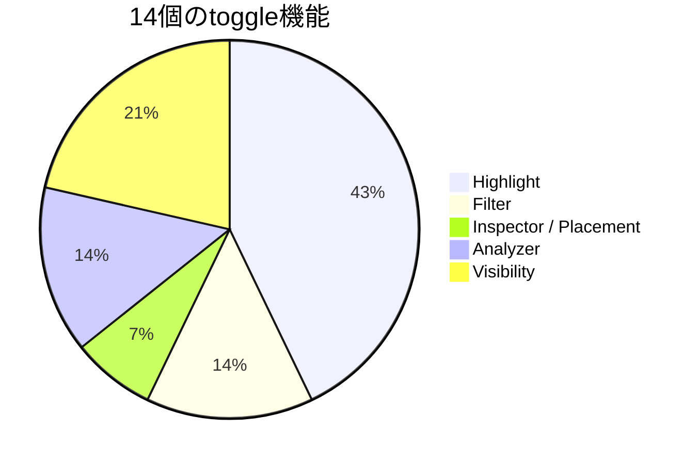
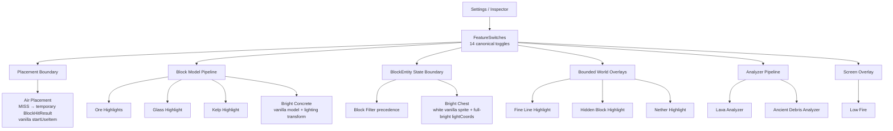

# ChiseTweaks

> Minecraftで「見えにくい」「置き方が合っているか分からない」「空中へ置きたい」「大きな建築の確認がつらい」を減らす、建築向けのFabricクライアントMODです。

ChiseTweaksは、**見つける・隠す・調べる・置き方を確認する・手動配置を補助する**ための機能を1つにまとめています。自動建築やサーバー側を迂回する独自配置処理は行いません。

Current version: **`0.14.0+mc26.1.2`**  
開発・QA・CI・Releaseの現在契約は [`DEVELOPMENT.md`](DEVELOPMENT.md) を参照してください。

## 必要環境

| 項目 | 対応 |
| --- | --- |
| Minecraft | `26.1.2` |
| Fabric Loader | `0.19.3` 以上 |
| Fabric API | `0.155.2+26.1.2` 以上 |
| Java | `25` 以上 |
| 導入先 | クライアントのみ |
| Mod Menu | 任意 |
| Sodium | 任意 |

`chise-tweaks-<version>.jar` をクライアントの `mods` フォルダーへ入れてください。サーバー側へChiseTweaksを導入する必要はありません。

> **マルチプレイ**: Air Placementは通常のMinecraft配置処理を使い、最終的な配置可否はサーバーが判断します。Lava Analyzer / Ancient Debris Analyzerは壁越し表示を行います。いずれも参加先サーバーのルールを優先してください。

## まず知っておくこと

設定画面には**14個のON/OFF機能**があります。Air Placementを含む12個は初期OFF、見やすさを補助する **Bright Chest / Bright Concreteだけ初期ON** です。Inspectorの読み取り・検証機能はtoggle数とは別のcapabilityです。

| Surface | Feature | 役割 | 初期値 |
| --- | --- | --- | --- |
| Highlight | **Ore Highlights** | 鉱石・古代の残骸・黒曜石系へ強調表示 | OFF |
| Highlight | **Nether Highlight** | 見えているネザー建材を色分け | OFF |
| Highlight | **Fine Line Highlight** | 糸・トリップワイヤーフック等を見やすくする | OFF |
| Highlight | **Hidden Block Highlight** | 粉雪・青氷・死んだサンゴ等を強調 | OFF |
| Highlight | **Glass Highlight** | ガラス／板ガラスの形を見分けやすくする | OFF |
| Highlight | **Kelp Highlight** | 昆布へネオンマーカーを重ねる | OFF |
| Filter | **Block Filter** | Block IDのAllow/Hideルールでローカル描画を絞る | OFF |
| Filter | **Entity Filter** | Entity IDのAllow/Hideルールでローカル描画を絞る | OFF |
| Inspector | **Air Placement** | 通常右クリックがMISSしたとき、最寄りの空中セルへ手持ちブロックを置く | OFF |
| Analyzer | **Lava Analyzer** | 読み込み済み近傍の溶岩源を壁越し表示 | OFF |
| Analyzer | **Ancient Debris Analyzer** | 読み込み済みNether chunkの古代の残骸を壁越し表示 | OFF |
| Visibility | **Low Fire** | 一人称の炎overlayを下げる | OFF |
| Visibility | **Bright Chest** | 通常Chest / Double Chestを白く明るく表示 | ON |
| Visibility | **Bright Concrete** | White Concreteを暗所でも判別しやすくする | ON |

`FeatureDefinition` / `FeatureSwitches` の14機能を正本として管理します。各toggleは独立しており、明示的な仕様がない限り相互排他にはしません。**14機能すべて同時ON**も回帰条件です。

## 設定画面

設定画面は5 Surfaceです。

| Tab | 用途 |
| --- | --- |
| **Highlight** | 見えている建材・鉱石・ガラス・昆布・細線などを強調 |
| **Filter** | ブロック／エンティティの表示をAllow/Hideルールで整理 |
| **Inspector** | Air Placement、BlockState、配置予測、配置結果、パターン差分を確認 |
| **Analyzer** | Lava / Ancient Debrisの限定的な壁越し解析 |
| **Visibility** | Low Fire / Bright Chest / Bright Concrete |

設定は `chisetweaks.json` と `chisetweaks-visual.json` の担当domainへ保存されます。UI・Inspector・監査は同じFeature registryを参照します。

## 実装の全体像

### Bright系は専用PNGを持ちません

Bright Chest / Bright Concreteは**Minecraftがすでに持っているassetを再利用**し、Chise専用PNGやbuilt-in Resource Pack selectionを持ちません。

- Bright Chest: 通常Chest geometryへMinecraftのWhite Concrete spriteを再利用し、`lightCoords`をfull-bright化
- Bright Concrete: White Concreteのvanilla model / textureをそのまま使い、quad lightingだけをfull-bright化
- Bright専用Chest / Concrete PNGなし
- Bright専用replacement modelなし
- built-in Resource Pack選択変更なし
- Bright切替時のResource Pack reloadなし

Block Filterで対象をHIDEした場合は、Bright Chestを含む視認補助より**Block Filterの非表示が優先**されます。

## Highlight

### Ore Highlights

鉱石、古代の残骸、黒曜石系などへ、元の見た目を残したまま強調表示を重ねます。壁越し探索ではありません。壁越しの古代の残骸表示はAncient Debris Analyzerです。

### Glass Highlight

透明／色付きガラスと板ガラスへ形状別のマーカーを重ねます。元のガラス色は保持します。

### Fine Line / Hidden Block / Nether Highlight

すでに読み込まれている近傍をbounded scanし、必要な対象だけをworld overlayへ渡します。未ロードchunkの強制読み込みは行いません。

### Kelp Highlight

昆布／昆布の茎へマゼンタ×オレンジの視認マーカーを重ねます。

## Filter

### Block Filter

Block IDを指定してAllow/Hideルールを作ります。通常ブロック、BlockEntity、Chise overlayでHIDE優先を維持します。ワールドからブロック自体を削除する機能ではありません。

### Entity Filter

Entity IDを指定してローカル描画をAllow/Hideします。一般的なocclusion/cullingは専用描画MODへ委ねます。

## Inspector / Placement

### Air Placement

TweakerooのAngel Block系の使い方を、ChiseTweaksでは**Survival / Creative両対応の手動配置補助**として提供します。

- 初期OFF
- ONでも、通常の右クリック結果が`MISS`のときだけ動作
- main hand / offhandのどちらかにBlockItemを持っている場合だけ候補を作る
- プレイヤーcollision boxの直外側にある最寄りのair blockを候補にする
- 読み込み済みchunkだけを扱い、未ロードchunkを強制loadしない
- Spectatorでは無効
- 通常のBLOCK / ENTITY右クリックは変更しない
- 自動クリック・連打・key injectionを行わない
- 独自play packetを送らない
- `Minecraft.startUseItem()`の実行中だけ仮想`BlockHitResult`を渡し、処理終了後は元のcrosshair hitへ必ず戻す
- Survivalではvanilla同様に配置したblockが1個消費される
- server側が配置を拒否する場合はその判断を迂回しない

つまりChiseTweaksが自動で建築する機能ではなく、**ユーザーが押した1回の通常use操作に「空中のクリック面」を補う機能**です。

### Crosshair Inspector

InspectorはMinecraftがすでに持つcrosshair hitとBlockStateから、読み取り専用snapshotを作ります。

### Placement Preview / Actual Comparison

対応ブロックは、置く直前のBlockStateを予測し、実際の配置後に `MATCH` / `ADJUSTED` / `DIFFERENT` を確認できます。Placement Preview自体は入力注入や自動設置を行いません。Air Placementは別toggleで、ユーザーが行う通常のuse操作だけを補助します。

代表的な対応対象:

- Trapdoor
- Log / Wood / Stem / Hyphae
- Froglight
- Slab / Stairs
- Glazed Terracotta
- Fence Gate
- Grindstone
- Beehive / Bee Nest
- Campfire

### Pattern Consistency

ユーザーが選んだReferenceと**同じBlock ID**の近傍BlockStateを比較します。多数決ではなくReferenceが正本です。対象は読み込み済みchunkに限定されます。

- 水平半径: 8 blocks
- 垂直範囲: ±4 blocks
- 最大処理: 256 blocks / tick
- 最大保持Mismatch: 64
- 再走査: 20 ticks
- Referenceはmemory-onlyで、dimension change / disconnect時に破棄

## Analyzer

### Lava Analyzer

近傍の**溶岩源だけ**を壁越しmarkerで表示します。flowing lavaは対象外です。探索はboundedで、読み込み済み範囲だけを扱います。

### Ancient Debris Analyzer

Netherで読み込み済みchunkからAncient Debrisを検出し、上限付きretained markerとして表示します。未ロードchunkを要求・生成しません。

LavaとAncient Debrisはrenderer lifecycleを共有しても、**scanner algorithmとtoggleは独立**しています。

## Visibility

### Low Fire

一人称視点のfire overlayだけを下げます。ワールド上の炎やresource-pack textureは変更しません。

### Bright Chest

通常Chest / Double Chestを白く明るく見せます。専用PNGは持たず、MinecraftのWhite Concrete spriteをChest modelへ再利用し、抽出済みrender stateの`lightCoords`をfull-brightへ上げます。

- 専用Chest PNGなし
- Chise専用texture atlasなし
- 追加draw callなし
- Resource Pack reloadなし
- Trapped / Ender / Copper Chestには白化を適用しない
- BlockEntity NBT、コンテナ内容、看板本文などを読み取らない

### Bright Concrete

White Concreteの**vanilla modelと現在のtextureをそのまま使用**し、そのmodelが出すquadへfull-bright lighting属性を適用します。

- 専用Concrete PNGなし
- 専用replacement modelなし
- 追加model emissionなし
- Resource Pack reloadなし
- block scanなし

使用中Resource PackがWhite Concreteのtextureを変更している場合も、そのtextureを土台として使います。

## 安全性と境界

ChiseTweaksはクライアント側の建築支援MODとして、次を行いません。

- サーバー側MODの導入要求
- ChiseTweaks独自のプレイ用packet送信
- 自動クリック／連打／keyboard input injection
- 自動建築やユーザー操作なしのblock設置／破壊
- serverの通常interaction判定の迂回
- 未ロードchunkの強制読み込み
- background threadによるworld scan
- 自動MOD download／JAR自己置換
- telemetry送信
- InspectorでのBlockEntity NBT、看板本文、本、chat、inventory、container内容、UUID取得

Air Placementだけはユーザーが明示的に行った1回の通常右クリックを空中配置へつなぎますが、vanilla/serverの配置処理をそのまま利用します。

## Performance

機能ごとに必要な方式だけを使います。

- Air Placement: use action時だけO(1)のtarget判定＋一時HitResult差し替え。常駐scan / overlayなし
- Ore / Glass / Kelp: block-model overlay pipeline
- Bright Concrete: vanilla block-model emission + in-place lighting transform
- Bright Chest: BlockEntity state extraction + vanilla sprite selection
- Block Filter: block / BlockEntity render boundary
- Fine Line / Hidden / Nether: bounded local scan + overlay
- Lava / Ancient Debris: bounded analyzer + retained marker
- Low Fire: first-person screen overlay

Bright系は専用PNG・専用Resource Pack・専用replacement modelを廃止したため、Bright ON/OFFのためのasset reloadはありません。

配布runtime JARには**446,814 bytesのhard ceiling**があります。機能等価性を壊す容量削減は採用しません。長期目標は350KiB (`358,400 bytes`) です。

## 開発・QA

変更はGitHub Actionsで以下を検証します。

- compile / JUnit
- repository / compatibility / functional parity audits
- JaCoCo coverage gate
- PIT mutation gate
- Client GameTest
  - vanilla Placement Preview oracle
  - 全14機能同時ON smoke
  - Survival Air Placement実配置＋1個消費
- artifact / visual asset / release residue audits
- runtime JAR size ceiling

GPU・shader・Prism Launcher上の見え方のようにheadless CIで完全自動化できない項目は、実機acceptanceとして別管理します。自動化できない確認をCI PASS扱いにはしません。

## License

リポジトリの `LICENSE` を参照してください。
